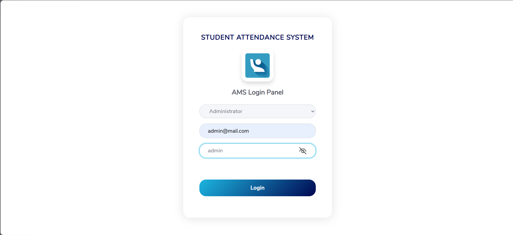
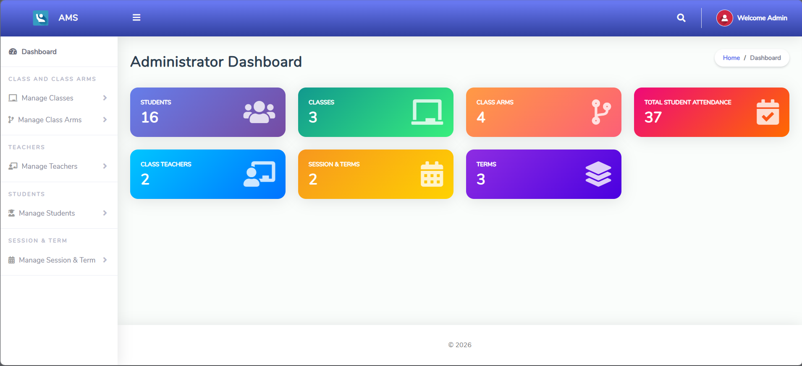
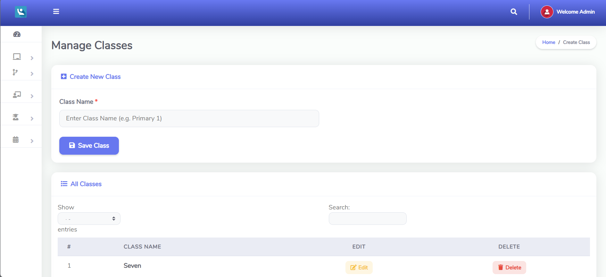
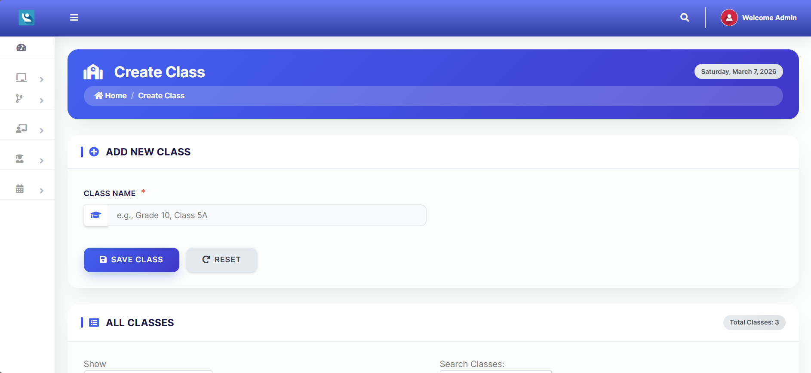
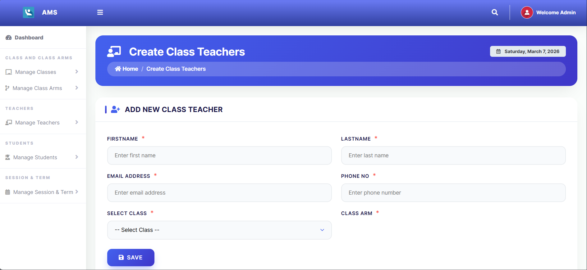
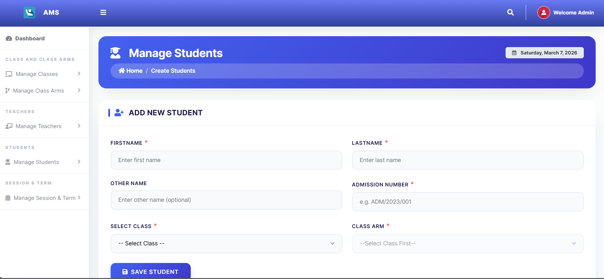
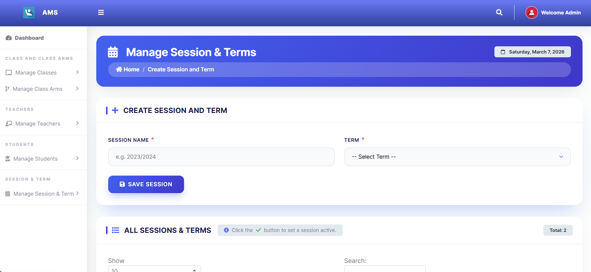

# Student Attendance Management System (SAMS)

A robust, enterprise-grade school management solution designed to streamline the daily attendance tracking process. Built with a focus on data integrity, security, and scalability, this system manages the lifecycle of academic sessions, course assignments, and student attendance records.

## 🚀 Key Features

* **Role-Based Authentication:** Secure login for Administrators and Class Teachers.
* **Academic Session Management:** Easily create and toggle between active academic sessions and terms.
* **Dynamic Course & Section Allocation:** Assign teachers to specific course sections with referential integrity.
* **Daily Attendance Workflow:** Efficient pre-loading of enrolled students with one-click "Present/Absent" toggling.
* **Historical Reporting:** View attendance records filtered by date and class section.
* **Security First:** Implementation of parameterized queries (OCI8) to prevent SQL Injection.

## 🛠 Tech Stack

* **Backend:** PHP 8.0+
* **Database:** Oracle Database 10g
* **Interface:** Bootstrap, HTML5, CSS3, JavaScript
* **Server:** XAMPP (Apache)
* **Connectivity:** PHP OCI8 Driver

## 💡 Technical Highlights (Migration to Oracle 10g)

This project features a custom-built database layer, migrating from traditional MySQL to a more enterprise-standard **Oracle 10g** environment. Key architectural challenges overcome during development:

1.  **Sequence-Based ID Generation:** Implemented custom Oracle Sequences (`NEXTVAL`) to replicate auto-increment functionality required for primary keys.
2.  **Date Handling:** Standardized date storage and retrieval using `TO_DATE` and `TRUNC` functions to ensure compatibility across system timezones.
3.  **Transaction Control:** Utilized `oci_commit` and `oci_rollback` to ensure that bulk attendance updates maintain data consistency (ACID compliance).
4.  **Prepared Statements:** Optimized database interactions using `oci_bind_by_name` for secure and high-performance querying.

## 📸 Project Screenshots

### 1. Login Panel

### 2. Admin Dashboard

### 3. Manage Classes

### 4. Create New Class

### 5. Teacher Management

### 6. Student Management

### 7. Session & Terms

## ⚙️ Installation & Setup

### Prerequisites
1.  **Oracle 10g Database** installed and running.
2.  **XAMPP** installed.
3.  **Oracle Instant Client** (Basic Package) installed and configured in your Windows System `Path`.

### Credentials
**Admin Login:**
* Email: `admin@mail.com`
* Password: `admin`

**Teacher Login:**
* Email: `teacher@mail.com`
* Password: `pass123`

---
*Built with ❤️ in Dhaka, Bangladesh.*
